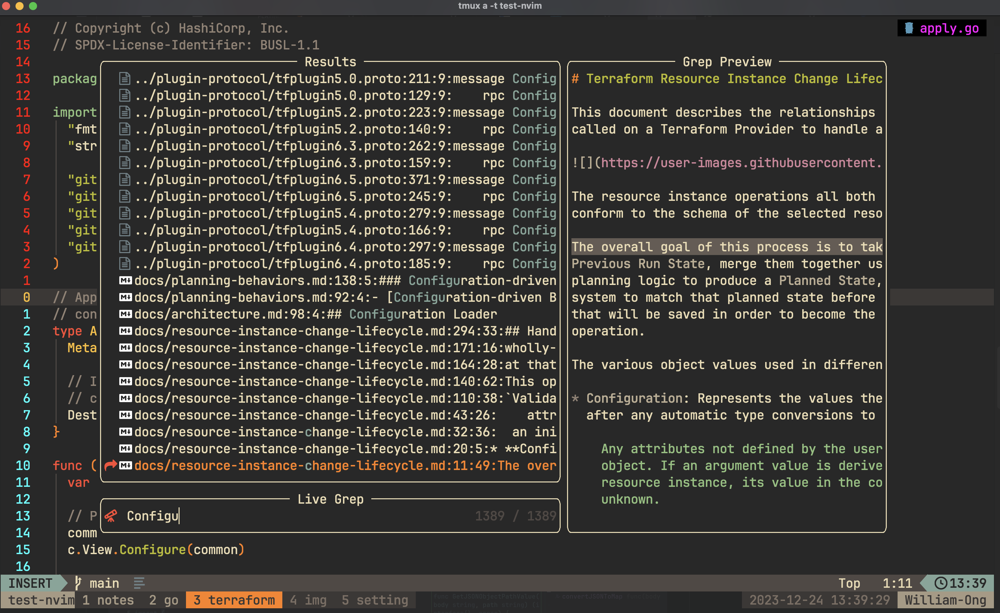
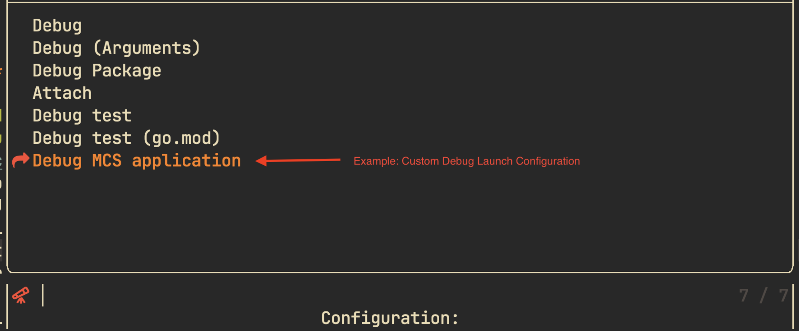
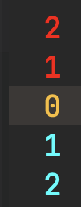
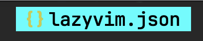
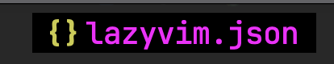

<p align="center"></p>

<h4 align="center">
  <a href="https://lazyvim.github.io/installation">Installation</a>
  ·
  <a href="https://lazyvim.github.io/configuration">Keymaps</a>
  ·
  <a href="https://lazyvim.github.io">Recipes</a>
</h4>

<p align="center"><b>💤 Snorlax.nvim: Personal lazyvim customization</b></p>

<p align="center">
  </p>

<div align="center"><p>
    <a href="https://github.com/william9923/snorlax.nvim/pulse">
      
    </a>
    <a href="https://github.com/william9923/snorlax.nvim">
      
    </a>
    
    
    <a href="https://github.com/ellisonleao/gruvbox.nvim">
     
    </a>
</p></div>

<p>Snorlax.nvim is a neovim setup customization from <a href="https://github.com/LazyVim/LazyVim">lazyvim</a> for easier customization and better config maintenance. Designed with same workflow as <a href="https://github.com/William9923/gyarados.nvim">gyarados.nvim</a> (my previous neovim configuration), but with better maintainability from with a lot of pre-configured package and setup by lazyvim (maintained by the community).</p>

<p>This config is made with few goals in mind as the successor of previous <a href="https://github.com/William9923/gyarados.nvim">gyarados.nvim</a> config</p>
<ul>
  <li>Remove unnecessary time to fix / maintain plugins update.</li>
  <li>Replace null ls as it had not been maintained anymore (there still exist community driven null ls)</li>
  <li>Replace lspSaga had a lot of breaking changes entering neovim v0.9</li>
  <li>Use the support from community maintained plugins (too much error from broken change in plugins that I use, got too annoying at this point)</li>
  <li>Allocate time more on expanding plugins functionality instead of maintaining current configs (there are a lot of frequent breaking changes when maintaining alone)</li>
  <li>Utilize DAP & Neotest support</li>
</ul>

<p align="center">
    
</p>

## Getting Started

<div align="center">
  <p><strong>Your editor, your style</strong></p>
  <p>With easier customization and better maintenance (via community effort)</p>
</div>

<p align="center">
  <p><strong>Syntax Highlighting</strong></p>
  
</ul>

<p align="center">
  <p><strong>Language Server (Definition, Reference, etc...)</strong></p>
  
</p>

<p align="center">
  <p><strong>Telescope (file finder)</strong></p>
  
</p>

<p align="center">
  <p><strong>Telescope (live finder)</strong></p>
  
</p>

<p align="center">
  <p><strong>Workspace diagnostic</strong></p>
  
</p>

<p align="center">
  <p><strong>File Tree viewer</strong></p>
  
</p>

<p align="center">
  <p><strong>Symbol Outline</strong></p>
  
</p>

<p align="center">
  <p><strong>TODO</strong></p>
  
</p>

**File Format:**

https://github.com/William9923/snorlax.nvim/assets/45505811/7250b014-6525-492b-b7fb-c3424eda88da

**Tmux Navigation:**

https://github.com/William9923/snorlax.nvim/assets/45505811/bbfdca79-d616-4048-af95-33e44d7a42da

**Non-repeat key Training (cowboy.nvim inspired):**

https://github.com/William9923/snorlax.nvim/assets/45505811/0c63cf15-7841-4202-ba9f-6b78ef8906a9

## Installation

<details><summary>Try it with Docker</summary>

```sh
docker run -w /root -it --rm alpine:edge sh -uelic '
  apk add git lazygit neovim ripgrep alpine-sdk --update
  git clone https://github.com/William9923/snorlax.nvim ~/.config/nvim
  cd ~/.config/nvim
  nvim
'
```

</details>

<details><summary>Install the snorlax.nvim, inspired by <a href="https://github.com/LazyVim/starter">LazyVim Starter</a></summary>

- Make a backup of your current Neovim files:

  ```sh
  mv ~/.config/nvim ~/.config/nvim.bak
  mv ~/.local/share/nvim ~/.local/share/nvim.bak
  ```

- Clone the configs

  ```sh
  git clone https://github.com/william9923/snorlax.nvim ~/.config/nvim
  ```

- Remove the `.git` folder, so you can add it to your own repo later

  ```sh
  rm -rf ~/.config/nvim/.git
  ```

- Start Neovim! (initial open take quite some times, as it need to download necessary tools & plugins)

  ```sh
  nvim
  ```

  Feel free to customize the nvim configs.

</details>

## Keymaps

Most of **snorlax.nvim** keymaps use original [lazyvim](https://www.lazyvim.org) keymaps which can be referred [here](https://www.lazyvim.org/keymaps)

- `<leader>` is `<space>`

Some customization is done by myself to suite my personal usage. Feel free to adjust based on your need (file location provided).

| Key          | Description                      | Location (File)         |
| :----------- | :------------------------------- | :---------------------- |
| `<leader>ss` | **Split window below**           | `config/keymaps.lua`    |
| `<leader>ff` | **Format Document**              | `config/keymaps.lua`    |
| `;l`         | **Show Lazy UI**                 | `config/lazy.lua`       |
| `;f`         | **Telescope find files**         | `plugins/telescope.lua` |
| `;r`         | **Telescope live grep (search)** | `plugins/telescope.lua` |
| `;b`         | **Telescope find buffers**       | `plugins/telescope.lua` |
| `;d`         | **Telescope show diagnostics**   | `plugins/telescope.lua` |
| `;k`         | **Telescope show keymaps**       | `plugins/telescope.lua` |
| `;t`         | **Show TODO**                    | `plugins/editor.lua`    |
| `<leader>sv` | **Split window right**           | `config/keymaps.lua`    |
| `<leader>sq` | **Close current split window**   | `config/keymaps.lua`    |
| `gh`         | **Lsp Reference**                | `plugins/lsp.lua`       |
| `<leader>lr` | **Symbol Rename**                | `plugins/lsp.lua`       |
| `<leader>la` | **Show Code Action**             | `plugins/lsp.lua`       |
| `[[`         | **Prev Reference**               | `plugins/editor.lua`    |
| `]]`         | **Next Reference**               | `plugins/editor.lua`    |
| `<leader>z`  | **Toggle code folding**          | `config/keymaps.lua`    |
| `<leader>,`  | **Prev buffer**                  | `config/lazy.lua`       |
| `<leader>.`  | **Next buffer**                  | `config/lazy.lua`       |
| `<leader>.`  | **Next buffer**                  | `config/lazy.lua`       |
| `<leader>a`  | **Toggle Symbol Outline**        | `plugins/coding.lua`    |
| `<leader>/`  | **Comment Code**                 | `plugins/comments.lua`  |
| `<leader>td` | **DAP Test Debug**               | `plugins/lsp.lua`       |
| `<leader>ww` | **Vimwiki**                      | `plugins/notes.lua`     |

## Recipes

[Lazyvim](https://www.lazyvim.org) provide some good example [recipes](https://www.lazyvim.org/configuration/recipes) to extend the editor. Here are some my personal recipes on top of it to further extend **snorlax.nvim** capabilities (in progress...)

### Add DAP Go debug launch configuration

- In `~/.config/nvim/lua/personal/dap-go.lua` => can find and adjust the lua function of `setup_go_configuration`. It's similar to VScode Debug configuration.

```lua
local function setup_go_configuration(dap, configs)
  dap.configurations.go = {
    {
      type = "go",
      name = "Debug",
      request = "launch",
      program = "${file}",
      buildFlags = configs.delve.build_flags,
    },
    {
      type = "go",
      name = "Debug (Arguments)",
      request = "launch",
      program = "${file}",
      args = get_arguments,
      buildFlags = configs.delve.build_flags,
    },
    {
      type = "go",
      name = "Debug Package",
      request = "launch",
      program = "${fileDirname}",
      buildFlags = configs.delve.build_flags,
    },
    {
      type = "go",
      name = "Attach",
      mode = "local",
      request = "attach",
      processId = filtered_pick_process,
      buildFlags = configs.delve.build_flags,
    },
    {
      type = "go",
      name = "Debug test",
      request = "launch",
      mode = "test",
      program = "${file}",
      buildFlags = configs.delve.build_flags,
    },
    {
      type = "go",
      name = "Debug test (go.mod)",
      request = "launch",
      mode = "test",
      program = "./${relativeFileDirname}",
      buildFlags = configs.delve.build_flags,
    },
    -- TODO: please add your debug configuration here...
  }

  if configs == nil or configs.dap_configurations == nil then
    return
  end

  for _, config in ipairs(configs.dap_configurations) do
    if config.type == "go" then
      table.insert(dap.configurations.go, config)
    end
  end
end
```



### Add Cursor Animation

- In `~/.config/nvim/lua/plugins/ui.lua`.

Please add this mini.ai animation plugins.

```lua
  {
    "echasnovski/mini.animate",
    event = "VeryLazy",
    opts = function(_, opts)
      local animate = require("mini.animate")
      opts.scroll = {
        enable = false,
      }
      opts.resize = {
        enable = false,
      }
      opts.open = {
        enable = false,
      }
      opts.close = {
        enable = false,
      }
      opts.cursor = {
        timing = animate.gen_timing.linear({ duration = 150, unit = "total" }), -- adjust the duration of how the cursor travel (in ms)
      }
    end,
  },
```

### Customize Greeter Prompt Screen

- In `~/.config/nvim/lua/plugins/ui.lua`.

Please find `nvimdev/dashboard-nvim` plugins and modified it.

```lua
{
    "nvimdev/dashboard-nvim",
    event = "VimEnter",
    opts = function(_, opts)
      -- NOTE: change the greeter logo here (utilize lua array)
      local logo = [[
      ██╗     ██╗███╗   ██╗██╗   ██╗██╗  ██╗██╗  ██╗███████╗██╗     ██╗
      ██║     ██║████╗  ██║██║   ██║╚██╗██╔╝██║  ██║██╔════╝██║     ██║
      ██║     ██║██╔██╗ ██║██║   ██║ ╚███╔╝ ███████║█████╗  ██║     ██║
      ██║     ██║██║╚██╗██║██║   ██║ ██╔██╗ ██╔══██║██╔══╝  ██║     ██║
          ███████╗██║██║ ╚████║╚██████╔╝██╔╝ ██╗██║  ██║███████╗███████╗███████╗
          ╚══════╝╚═╝╚═╝  ╚═══╝ ╚═════╝ ╚═╝  ╚═╝╚═╝  ╚═╝╚══════╝╚══════╝╚══════╝
        by: William Ong
      ]]

      logo = string.rep("\n", 8) .. logo .. "\n\n"
      opts.config.header = vim.split(logo, "\n")
      -- NOTE: change window greeter footer
      local footer = function()
        local stats = require("lazy").stats()
        return {
          "⚡ Neovim loaded " .. stats.loaded .. "/" .. stats.count .. " plugins",
        }
      end
      opts.config.footer = footer()
      opts.config.center = {
        -- NOTE: change which action for the window greeter
        { action = "Telescope find_files", desc = " Find file", icon = " ", key = "f" },
        { action = 'lua require("persistence").load()', desc = " Restore Session", icon = " ", key = "s" },
        { action = "Lazy", desc = " Lazy", icon = "󰒲 ", key = "l" },
        { action = "qa", desc = " Quit", icon = " ", key = "q" },
      }
    end,
  }
```

### Change Editor Color

#### Line Number

- In `~/.config/nvim/lua/config/autocmds.lua`.

For the line number, we differentiate the color using autocommands.

```lua
vim.api.nvim_create_autocmd({ "BufEnter" }, {
  callback = function()
    vim.cmd("hi LineNrAbove guifg=red ctermfg=red") -- NOTE: line number above current cursor is red. Please use vim color reference for more color.
    vim.cmd("hi LineNrBelow guifg=cyan ctermfg=cyan") -- NOTE: line number below current cursor is cyan. Please use vim color reference for more color.
  end,
})
```



#### File Name Previewer

- In `~/.config/nvim/lua/plugins/ui.lua`.

For the file name previewer, we use `b0o/incline.nvim` plugins.

```lua
  -- buffer filename
  {
    "b0o/incline.nvim",
    event = "BufReadPre",
    priority = 1200,
    config = function()
      require("incline").setup({
        highlight = {
          groups = {
            InclineNormal = { guibg = "cyan", guifg = "black" }, -- color when in buffer
            InclineNormalNC = { guifg = "magenta", guibg = "black" }, -- color when not in buffer
          },
        },
        window = { margin = { vertical = 0, horizontal = 1 } },
        hide = {
          cursorline = true,
        },
        render = function(props)
          local filename = vim.fn.fnamemodify(vim.api.nvim_buf_get_name(props.buf), ":t")
          if vim.bo[props.buf].modified then
            filename = "[+] " .. filename -- NeoTree symbol when file modified
          end

          local icon, color = require("nvim-web-devicons").get_icon_color(filename)
          return { { icon, guifg = color }, { " " }, { filename } }
        end,
      })
    end,
  },
```




### Filter Notifications from vim-notify

- In `~/.config/nvim/lua/plugins/ui.lua`.

As `lazyvim` use noice, for some people the number of messages that pop out might be annoying. Feel free to add any template to filter on the lua table.

```lua
  {
    "folke/noice.nvim",
    opts = function(_, opts)
      table.insert(opts.routes, {
        filter = {
          event = "notify",
          find = "No information available",
        },
        opts = { skip = true },
      })
      table.insert(opts.routes, {
        filter = {
          event = "msg_show",
          -- NOTE: add any not important / annoying message here
          any = {
            { find = "%d+L, %d+B" },
            { find = "; after #%d+" },
            { find = "; before #%d+" },
            { find = "%d+ more lines" },
            { find = "%d+ fewer lines" },
            { find = "%d+ lines yanked" },
          },
        },
        view = "mini",
        opts = { skip = true },
      })
      local focused = true
      vim.api.nvim_create_autocmd("FocusGained", {
        callback = function()
          focused = true
        end,
      })
      vim.api.nvim_create_autocmd("FocusLost", {
        callback = function()
          focused = false
        end,
      })
      table.insert(opts.routes, 1, {
        filter = {
          cond = function()
            return not focused
          end,
        },
        view = "notify_send",
        opts = { stop = false },
      })
      opts.commands = {
        all = {
          -- options for the message history that you get with `:Noice`
          view = "split",
          opts = { enter = true, format = "details" },
          filter = {},
        },
      }
      vim.api.nvim_create_autocmd("FileType", {
        pattern = "markdown",
        callback = function(event)
          vim.schedule(function()
            require("noice.text.markdown").keys(event.buf)
          end)
        end,
      })
      opts.presets.lsp_doc_border = false
      opts.presets.bottom_search = true
    end,
  },
```

### Add formatter for certain filetypes

- In `~/.config/nvim/lua/plugins/formatting.lua`.

Utilize `conform.nvim` plugins for formatting.

```lua
{
  "stevearc/conform.nvim",
  dependencies = { "mason.nvim" },
  lazy = true,
  cmd = "ConformInfo",
  opts = {
    ---@type table<string, conform.FormatterUnit[]>
    -- NOTE: add formatter here => formatter installed separately (conform didn't automatically install it for you!)
    formatters_by_ft = {
      lua = { "stylua" },
      sh = { "shfmt" },
      -- NOTE: Conform will run multiple formatters sequentially
      python = { "black", "isort" },
      -- NOTE: Use a sub-list to run only the first available formatter
      javascript = { { "prettierd", "prettier" } },
      rust = { "rustfmt" },
      go = { { "gofmt", "goimports" } },
      sql = { "pg_format", "sql_formatter" },
      yaml = { "yamlfmt" },
    },
  },
}
```

### Change git blame virtual text format

- In `~/.config/nvim/lua/plugins/formatting.lua`.

To customize the git blame virtual text, edit the `current_line_blame_formatter` field in the `gitsigns.nvim` opts.

```lua
  {
    "lewis6991/gitsigns.nvim",
    event = "LazyFile",
    opts = {
      current_line_blame = true, -- Toggle with `:Gitsigns toggle_current_line_blame`
      current_line_blame_opts = {
        virt_text = true,
        virt_text_pos = "eol", -- 'eol' | 'overlay' | 'right_align'
        delay = 50,
        ignore_whitespace = false,
        virt_text_priority = 5000,
      },
      current_line_blame_formatter = "<author> • <author_time:%Y-%m-%d> • <summary>",
    },
  },
```

For other related to LazyVim, please refer to LazyVim [recipes](https://www.lazyvim.org/configuration/recipes) page

## Special thanks to...

- [LazyVim](https://github.com/LazyVim/LazyVim)
- [Craftzdog Dotfiles](https://github.com/craftzdog/dotfiles-public)

## ❤️ Support

If you feel that this repo have helped you provide more example on learning software engineering, then it is enough for me! Wanna contribute more? Please ⭐ this repo so other can see it too!
