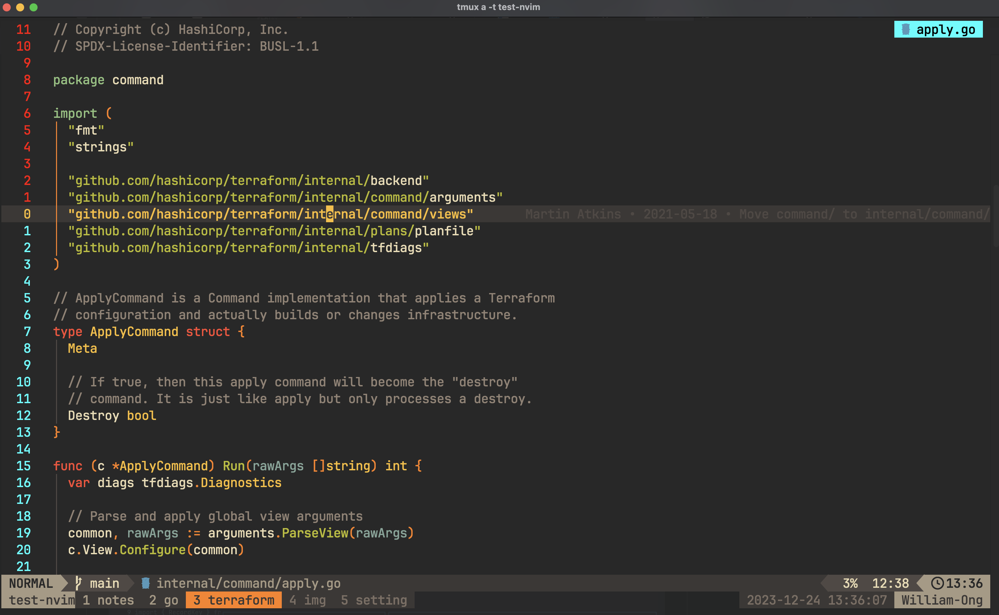
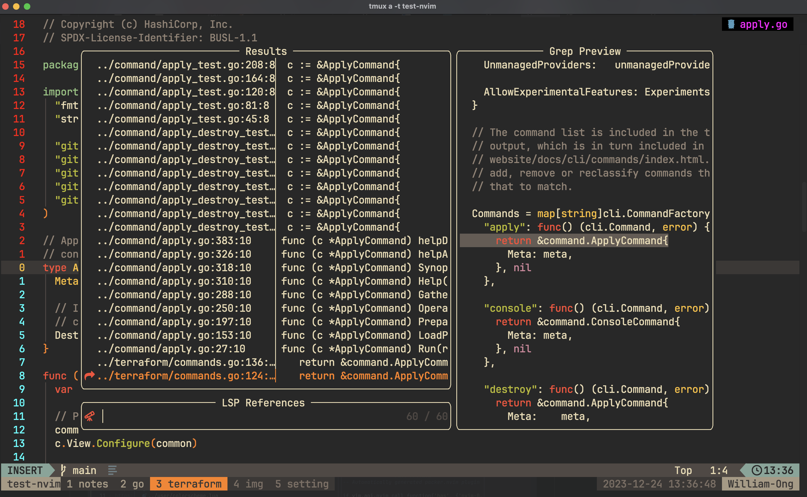
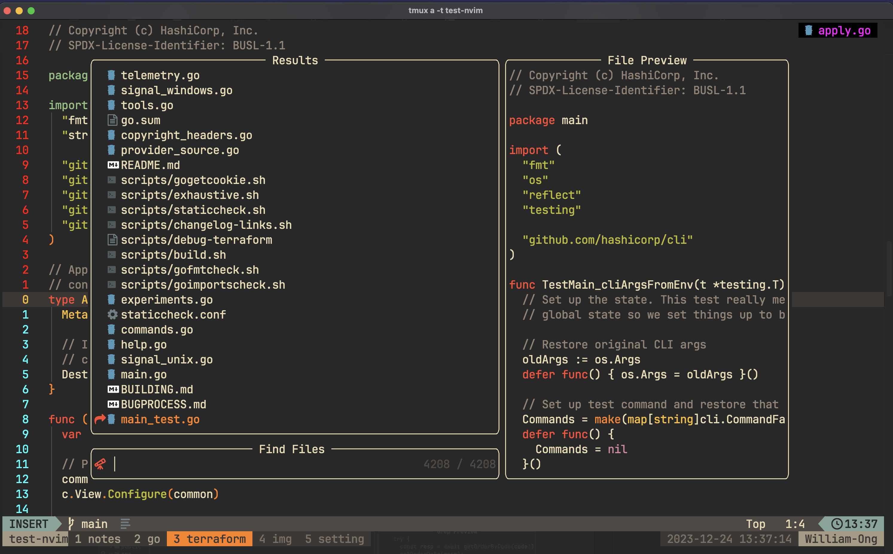
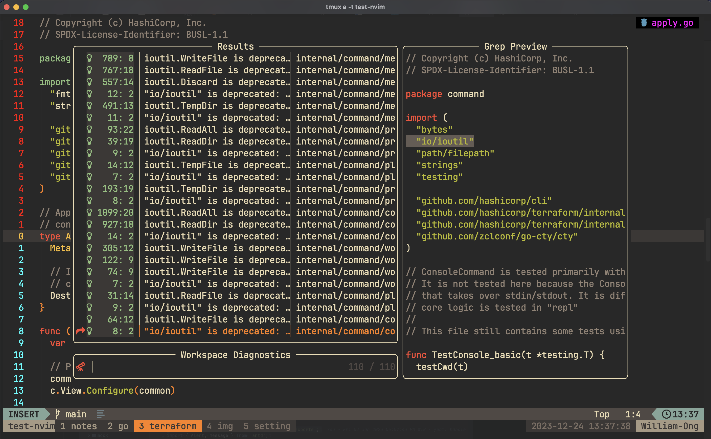
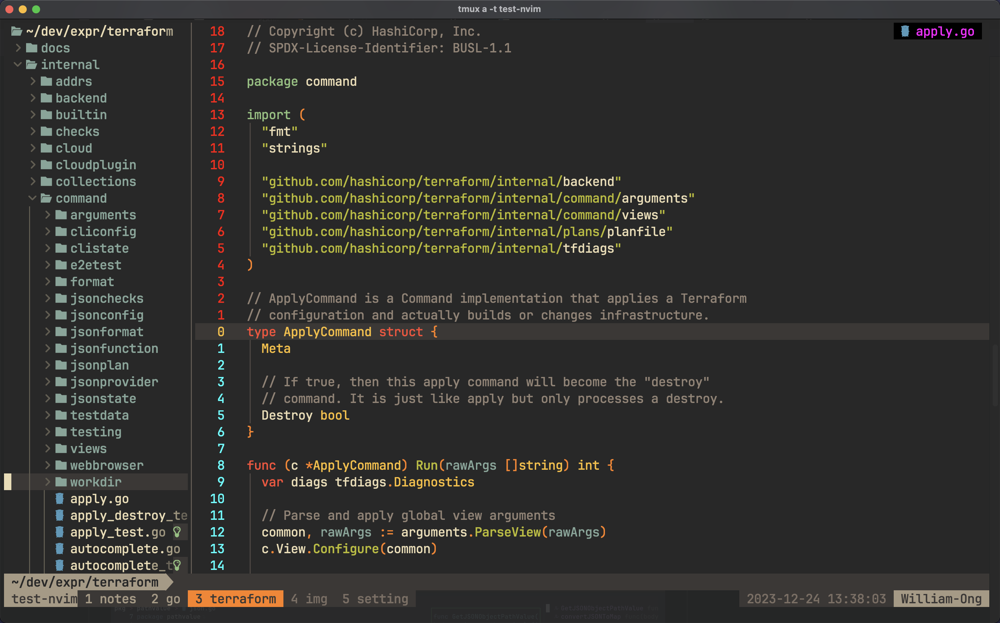
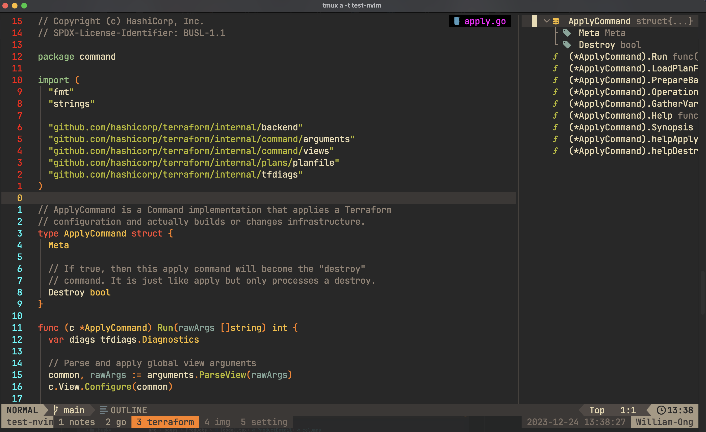
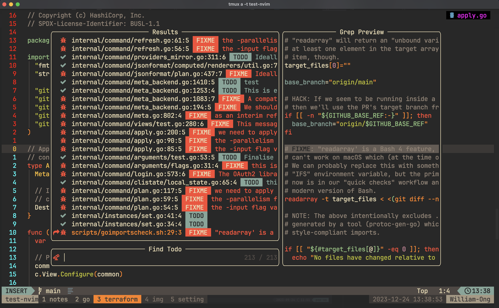

<p align="center"></p>

<h4 align="center">
  <a href="https://lazyvim.github.io/installation">Installation</a>
  ·
  <a href="https://lazyvim.github.io/configuration">Keymaps</a>
  ·
  <a href="https://lazyvim.github.io">Recipes</a>
</h4>

<p align="center"><b>💤 Snorlax.nvim: Personal lazyvim customization</b></p>

<p align="center">
  </p>

<div align="center"><p>
    <a href="https://github.com/william9923/snorlax.nvim/pulse">
      
    </a>
    <a href="https://github.com/william9923/snorlax.nvim">
      
    </a>
    
    
    <a href="https://github.com/ellisonleao/gruvbox.nvim">
     
    </a>
</p></div>

<p>Snorlax.nvim is a neovim setup customization from <a href="https://github.com/LazyVim/LazyVim">lazyvim</a> for easier customization and better config maintenance. Designed with same workflow as <a href="https://github.com/William9923/gyarados.nvim">gyarados.nvim</a> (my previous neovim configuration), but with better maintainability from with a lot of pre-configured package and setup by lazyvim (maintained by the community).</p>

<p>This config is made with few goals in mind as the successor of previous <a href="https://github.com/William9923/gyarados.nvim">gyarados.nvim</a> config</p>
<ul>
  <li>Remove unnecessary time to fix / maintain plugins update.</li>
  <li>Replace null ls as it had not been maintained anymore (there still exist community driven null ls)</li>
  <li>Replace lspSaga had a lot of breaking changes entering neovim v0.9</li>
  <li>Use the support from community maintained plugins (too much error from broken change in plugins that I use, got too annoying at this point)</li>
  <li>Allocate time more on expanding plugins functionality instead of maintaining current configs (there are a lot of frequent breaking changes when maintaining alone)</li>
  <li>Utilize DAP & Neotest support</li>
</ul>

<p align="center">
    
</p>

## Getting Started

### Features

<div align="center">
  <p><strong>Your editor, your style</strong></p>
  <p>With easier customization and better maintenance (via community effort)</p>
</div>

<p align="center">
  <p><strong>Syntax Highlighting</strong></p>
  
</ul>

<p align="center">
  <p><strong>Language Server (Definition, Reference, etc...)</strong></p>
  
</p>

<p align="center">
  <p><strong>Telescope (file finder)</strong></p>
  
</p>

<p align="center">
  <p><strong>Workspace diagnostic</strong></p>
  
</p>

<p align="center">
  <p><strong>File Tree viewer</strong></p>
  
</p>

<p align="center">
  <p><strong>Symbol Outline</strong></p>
  
</p>

<p align="center">
  <p><strong>Formatting (conform.nvim)</strong></p>
  <video width="320" height="240" controls>
    <source src="docs/format-file.mov" type="video/mp4">
    Your browser does not support the video tag.
  </video> 
</p>

<p align="center">
  <p><strong>TODO</strong></p>
  
</p>

### Quick Start

Open `nvim` and enter the following:

```
:checkhealth
```

You'll probably notice you don't have support for copy/paste also that python and node haven't been setup

So let's fix that

First we'll fix copy/paste

- On mac `pbcopy` should be builtin

- On Ubuntu

  ```sh
  sudo apt install xsel # for X11
  sudo apt install wl-clipboard # for wayland
  ```

Next we need to install python support (node is optional)

- Neovim python support

  ```sh
  pip install pynvim
  ```

- Neovim node support

  ```sh
  npm i -g neovim
  ```

We will also need `ripgrep` for Telescope to work:

- Ripgrep

  ```sh
  sudo apt install ripgrep
  ```

Tree-sitter setup

```sh
:TSInstall all
```

## Fonts

I personally like Jetbrains Mono Nerd Font, but the font is not defined in the neovim setting. You should configure it in your terminal settings.

## Configuration

### Formatters and linters

In this neovim configuration, I provided some of the formatters and linters that I personally use:

- Prettier : for javascript and typescript
- Black : for Python
- Stylua : for Lua script
- Goimports : for Golang
- Shfmt : for shell scripts

You can configure new formatters and linters easily in `lua/user/lsp`

## Thanks to...

- [LunarVim](https://github.com/LunarVim/nvim-basic-ide)

## ❤️ Support

If you feel that this repo have helped you provide more example on learning software engineering, then it is enough for me! Wanna contribute more? Please ⭐ this repo so other can see it too!
