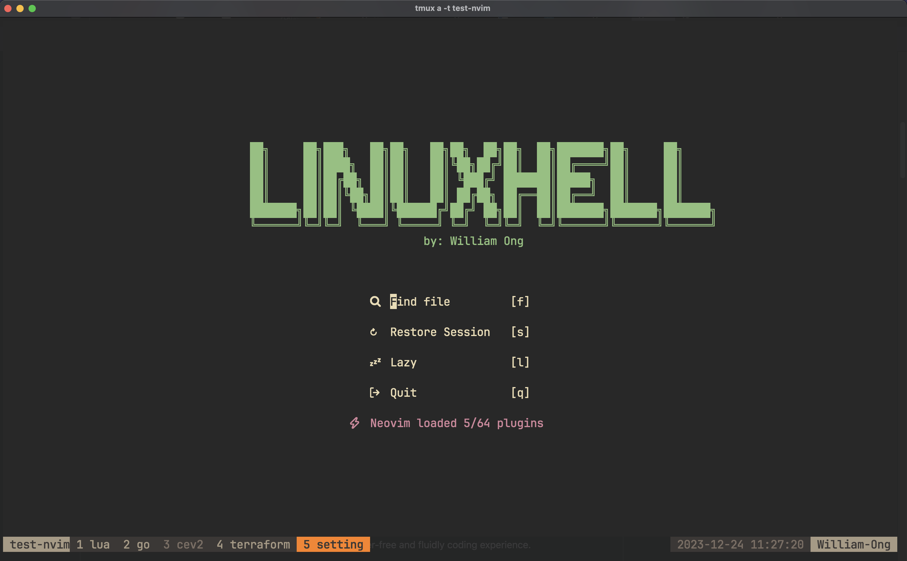

<p align="center"></p>

<h4 align="center">
  <a href="https://lazyvim.github.io/installation">Installation</a>
  ·
  <a href="https://lazyvim.github.io/configuration">Keymaps</a>
  ·
  <a href="https://lazyvim.github.io">Recipes</a>
</h4>

<p align="center"><b>💤 Snorlax.nvim: Personal lazyvim customization</b></p>

<p align="center">
  </p>

<div align="center"><p>
    <a href="https://github.com/william9923/snorlax.nvim/pulse">
      
    </a>
    <a href="https://github.com/william9923/snorlax.nvim">
      
    </a>
    
    
    <a href="https://github.com/ellisonleao/gruvbox.nvim">
     
    </a>
</p></div>

<p>Snorlax.nvim is a neovim setup customization from <a href="https://github.com/LazyVim/LazyVim">lazyvim</a> for easier customization and better config maintenance. Designed with same workflow as <a href="https://github.com/William9923/gyarados.nvim">gyarados.nvim</a> (my previous neovim configuration), but with better maintainability from with a lot of pre-configured package and setup by lazyvim (maintained by the community).</p>

<p>This config is made with few goals in mind as the successor of previous <a href="https://github.com/William9923/gyarados.nvim">gyarados.nvim</a> config</p>
<ul>
  <li>Remove unnecessary time to fix / maintain plugins update.</li>
  <li>Replace null ls as it had not been maintained anymore (there still exist community driven null ls)</li>
  <li>Replace lspSaga had a lot of breaking changes entering neovim v0.9</li>
  <li>Use the support from community maintained plugins (too much error from broken change in plugins that I use, got too annoying at this point)</li>
  <li>Allocate time more on expanding plugins functionality instead of maintaining current configs (there are a lot of frequent breaking changes when maintaining alone)</li>
  <li>Utilize DAP & Neotest support</li>
</ul>

<p align="center">
    
</p>

## Getting Started

<div align="center">
  <p><strong>Your editor, your style</strong></p>
  <p>With easier customization and better maintenance (via community effort)</p>
</div>

<p align="center">
  <p><strong>Syntax Highlighting</strong></p>
  
</ul>

<p align="center">
  <p><strong>Language Server (Definition, Reference, etc...)</strong></p>
  
</p>

<p align="center">
  <p><strong>Telescope (file finder)</strong></p>
  
</p>

<p align="center">
  <p><strong>Telescope (live finder)</strong></p>
  
</p>

<p align="center">
  <p><strong>Workspace diagnostic</strong></p>
  
</p>

<p align="center">
  <p><strong>File Tree viewer</strong></p>
  
</p>

<p align="center">
  <p><strong>Symbol Outline</strong></p>
  
</p>

<p align="center">
  <p><strong>TODO</strong></p>
  
</p>

**File Format:**

https://github.com/William9923/snorlax.nvim/assets/45505811/7250b014-6525-492b-b7fb-c3424eda88da

**Tmux Navigation:**

https://github.com/William9923/snorlax.nvim/assets/45505811/bbfdca79-d616-4048-af95-33e44d7a42da

**Non-repeat key Training (cowboy.nvim inspired):**

https://github.com/William9923/snorlax.nvim/assets/45505811/0c63cf15-7841-4202-ba9f-6b78ef8906a9

## Installation

<details><summary>Try it with Docker</summary>

```sh
docker run -w /root -it --rm alpine:edge sh -uelic '
  apk add git lazygit neovim ripgrep alpine-sdk --update
  git clone https://github.com/William9923/snorlax.nvim ~/.config/nvim
  cd ~/.config/nvim
  nvim
'
```

</details>

<details><summary>Install the snorlax.nvim, inspired by <a href="https://github.com/LazyVim/starter">LazyVim Starter</a></summary>

- Make a backup of your current Neovim files:

  ```sh
  mv ~/.config/nvim ~/.config/nvim.bak
  mv ~/.local/share/nvim ~/.local/share/nvim.bak
  ```

- Clone the configs

  ```sh
  git clone https://github.com/william9923/snorlax.nvim ~/.config/nvim
  ```

- Remove the `.git` folder, so you can add it to your own repo later

  ```sh
  rm -rf ~/.config/nvim/.git
  ```

- Start Neovim! (initial open take quite some times, as it need to download necessary tools & plugins)

  ```sh
  nvim
  ```

  Feel free to customize the nvim configs.

</details>

## Keymaps

Most of **snorlax.nvim** keymaps use original [lazyvim](https://www.lazyvim.org) keymaps which can be referred [here](https://www.lazyvim.org/keymaps)

- `<leader>` is `<space>`

Some customization is done by myself to suite my personal usage. Feel free to adjust based on your need (file location provided).

| Key          | Description                      | Location (File)         |
| :----------- | :------------------------------- | :---------------------- |
| `<leader>ss` | **Split window below**           | `config/keymaps.lua`    |
| `<leader>ff` | **Format Document**              | `config/keymaps.lua`    |
| `;l`         | **Show Lazy UI**                 | `config/lazy.lua`       |
| `;f`         | **Telescope find files**         | `plugins/telescope.lua` |
| `;r`         | **Telescope live grep (search)** | `plugins/telescope.lua` |
| `;b`         | **Telescope find buffers**       | `plugins/telescope.lua` |
| `;d`         | **Telescope show diagnostics**   | `plugins/telescope.lua` |
| `;k`         | **Telescope show keymaps**       | `plugins/telescope.lua` |
| `;t`         | **Show TODO**                    | `plugins/editor.lua`    |
| `<leader>sv` | **Split window right**           | `config/keymaps.lua`    |
| `<leader>sq` | **Close current split window**   | `config/keymaps.lua`    |
| `gh`         | **Lsp Reference**                | `plugins/lsp.lua`       |
| `<leader>lr` | **Symbol Rename**                | `plugins/lsp.lua`       |
| `<leader>la` | **Show Code Action**             | `plugins/lsp.lua`       |
| `[[`         | **Prev Reference**               | `plugins/editor.lua`    |
| `]]`         | **Next Reference**               | `plugins/editor.lua`    |
| `<leader>z`  | **Toggle code folding**          | `config/keymaps.lua`    |
| `<leader>,`  | **Prev buffer**                  | `config/lazy.lua`       |
| `<leader>.`  | **Next buffer**                  | `config/lazy.lua`       |
| `<leader>.`  | **Next buffer**                  | `config/lazy.lua`       |
| `<leader>a`  | **Toggle Symbol Outline**        | `plugins/coding.lua`    |
| `<leader>/`  | **Comment Code**                 | `plugins/comments.lua`  |
| `<leader>td` | **DAP Test Debug**               | `plugins/lsp.lua`       |
| `<leader>ww` | **Vimwiki**                      | `plugins/notes.lua`     |

## Recipes

[Lazyvim](https://www.lazyvim.org) provide some good example [recipes](https://www.lazyvim.org/configuration/recipes) to extend the editor. Here are some my personal recipes on top of it to further extend **snorlax.nvim** capabilities (in progress...)

### Add DAP Go debug launch configuration

(TODO)

### Add Cursor Animation

(TODO)

### Customize Greeter Prompt Screen

(TODO)

### Change Editor Color

#### Line Number

(TODO)

#### File Name Previewer

(TODO)

### Filter Notifications from vim-notify

(TODO)

### Add formatter for certain filetypes

(TODO)

### Change git blame virtual text format

(TODO)

### Change git blame virtual text format

(TODO)

For other related to LazyVim, please refer to LazyVim [recipes](https://www.lazyvim.org/configuration/recipes) page

## Special thanks to...

- [LazyVim](https://github.com/LazyVim/LazyVim)

## ❤️ Support

If you feel that this repo have helped you provide more example on learning software engineering, then it is enough for me! Wanna contribute more? Please ⭐ this repo so other can see it too!
